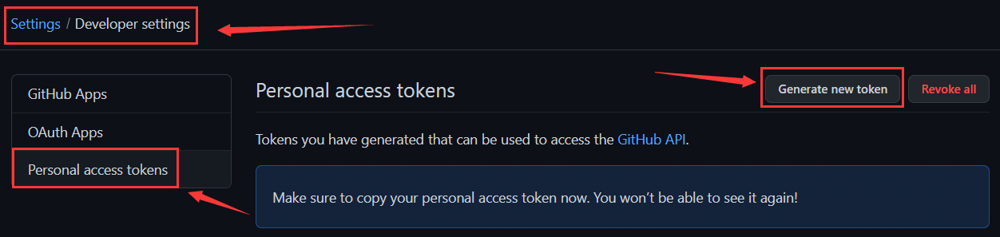
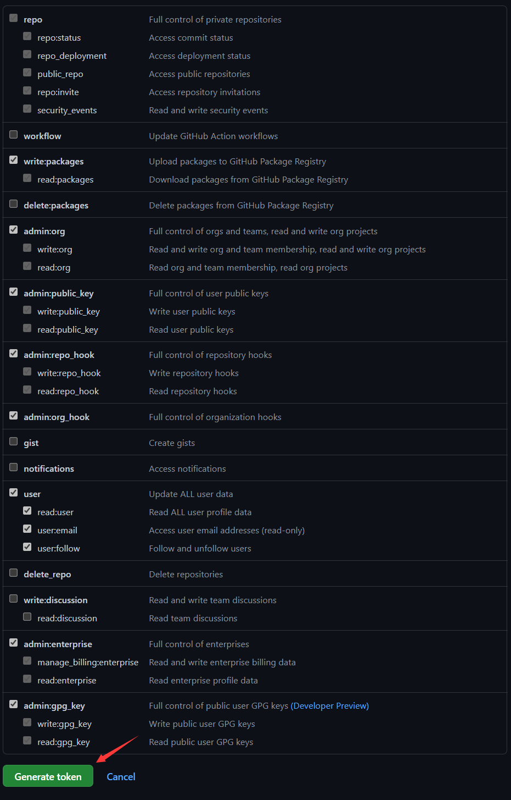
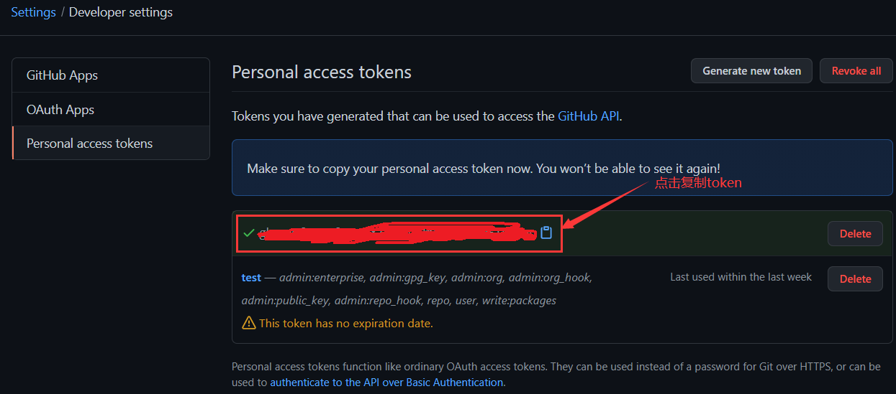

## 使用说明
首先需要安装python3依赖： `pip3 install -r ./requirements.txt` 

### 0x00 数据库设置
1. 在自己的 mysql 数据库服务器上，创建数据库：git_monitor
2. 在 git_monitor 数据库上运行 `./sql/scan_res.sql` 创建数据表
3. 在 `./libs/setting.py` 中配置自己的数据库配置

### 0x01 配置邮件通知
直接在 `./libs/setting.py` 中配置

### 0x02 配置GitHubToken
**推荐至少使用三个不同github账号**

登录Github后，进入 `Settings -> Developer settings` :

勾选如下：

得到 github token :

将得到的 Github Token 存放在 `./config/tokens.txt` 中，一行一个，推荐3个以上

### 0x03 配置监控目标
在 `./targets/xxx.txt` 中填写需要监控的目标域名。

例如在 `./targets/baidu.com.txt` 中填写：

    home.baidu.com
    mail.baidu.com
    email.baidu.com

将会监控这些域名相关的信息泄露。

### 0x04 定制傻瓜字典
程序内部使用了一个内置的傻瓜字典，从网上copy下来的，挺大的，但是感觉可能并不适用于任何人。

可以自己定制自己的关键字放在 `./dict/xxx.txt` 中，一行一个傻瓜关键字。

例如在 `./dict/shiro_keywors.txt` 中添加：

    shiro_key
    remember_me_key
    
## 一些说明
- Github有请求限制，一级限制：每分钟只能发送30个请求；二级限制：发送频率不能太高，且不能重复发送消耗性大的请求；
- 内置一个傻瓜关键字字典，只需往 `./targets/xxx.txt` 中添加待监控的域名即可，配合傻瓜字典进行搜索；
- 如果不想使用傻瓜字典也可，在 `run.py` 指定 `dorkers=None` 即可，但是这样要求你自己构造合适的关键字；
- 如果待监控的资产多，可能需要运行很久，可以多配置几个token加快速度；
- 如果发现新资产，会发送邮件进行提醒，并发送新增信息的邮件附件；